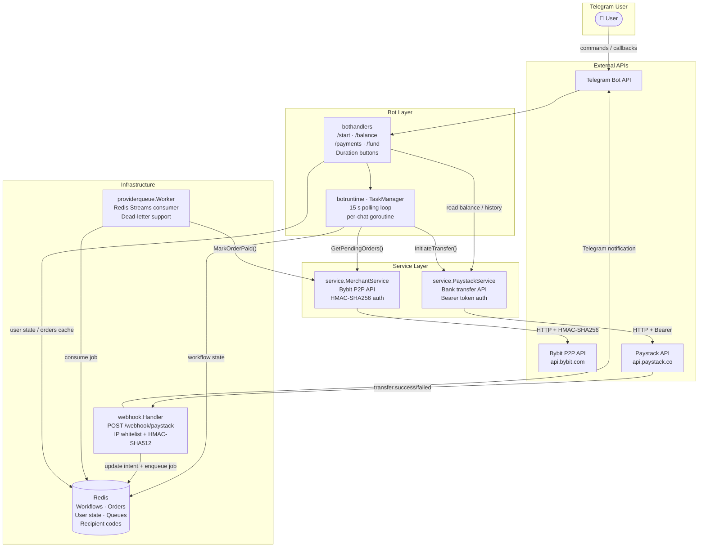
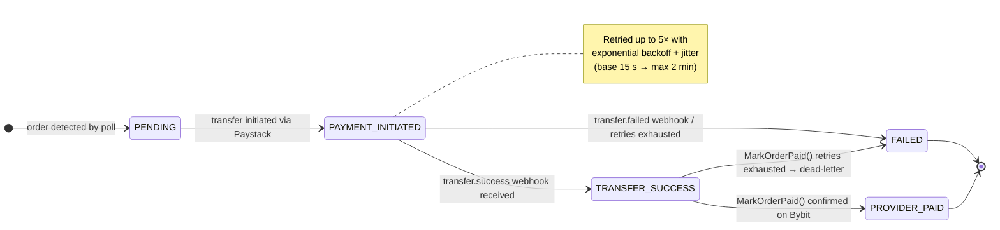

# mtg-bot

> **Pay-as-you-go autonomous agent bot that automates Bybit P2P crypto order processing and executes NGN bank transfers via Paystack. Merchants can attemd to orders without having to be there**

[mtg-bot banner](docs/banner.png)


<!-- Replace the URL below once a CI workflow exists at .github/workflows/ci.yml -->
<!--  -->

---

## Table of Contents

1. [Overview](#overview)
2. [Features](#features)
3. [Architecture](#architecture)
4. [Order State Machine](#order-state-machine)
5. [Folder Structure](#folder-structure)
6. [External Services](#external-services)
7. [Prerequisites](#prerequisites)
8. [Configuration](#configuration)
9. [Running Locally](#running-locally)
10. [Makefile Reference](#makefile-reference)
11. [Testing](#testing)
12. [Webhook Setup](#webhook-setup)
13. [Observability](#observability)
14. [Assets & Media Needed](#assets--media-needed)
15. [Contributing](#contributing)

---

## Overview

`mtg-bot` is a **pay-as-you-go Telegram bot** that lets a user purchase a time-boxed session (1, 3, or 6 hours) during which the bot:

1. Polls their Bybit P2P account every **15 seconds** for pending buy orders
2. Reads the order's payment details (account number, bank, amount)
3. Resolves the recipient via Paystack, initiates an NGN bank transfer
4. Listens for the `transfer.success` webhook event from Paystack
5. Marks the Bybit order as paid via the P2P API
6. Reports status back to the user over Telegram
7. Orders are being proceeesed while marchan can fous on other tasks without worry.

The merchant charges the user the **total transfer budget + a service fee**. All state is stored in Redis; the bot is stateless across restarts.

---

## Features

- **Pay-as-you-go sessions** — users select session duration (1 h / 3 h / 6 h) and pay upfront
- **Automated order processing** — 15 s polling loop, order per workflow with state persistence
- **Exponential backoff retries** — configurable base/max delay and jitter; terminal vs. transient error classification
- **Idempotent webhook processing** — 48-hour deduplication window prevents double transfers
- **Async job queue** — Redis Streams-backed worker marks Bybit orders paid after confirmed transfer
- **Bank list caching** — Paystack bank list refreshed every 24 h; recipient codes cached 30 days
- **Graceful shutdown** — SIGINT/SIGTERM drains in-flight work within a 10-second window
- **Race-detector safe** — `make run-bot` enables `-race` by default

---

## Architecture



---

## Order State Machine



---

## Folder Structure

```
mtg-bot/
├── cmd/
│   └── mtg-bot/
│       ├── main.go            # Entry point — signal handling, server start, graceful shutdown
│       └── bootstrap.go       # Wires all dependencies (config, HTTP clients, Redis, caches)
│
├── internal/
│   ├── bothandlers/
│   │   └── handlers.go        # Telegram command & callback handlers (/start, /balance, /payments, /fund)
│   │
│   ├── botruntime/
│   │   ├── runtime.go         # TaskManager — per-chat goroutines, 15 s poll loop, workflow execution
│   │   ├── runtime_test.go
│   │   ├── retry.go           # RetryPolicy — exponential backoff with ±15% jitter, error classification
│   │   └── retry_test.go
│   │
│   ├── cache/
│   │   ├── types.go                           # All cache/store interfaces
│   │   ├── banks_redis.go                     # BankCache — country → bank list (TTL 24 h)
│   │   ├── orders_redis.go                    # OrdersCache — pending orders per chat (TTL 30 s)
│   │   ├── payment_intent_redis.go            # PaymentIntentStore — intent lifecycle + chat index
│   │   ├── payment_intent_redis_test.go
│   │   ├── provider_mark_queue_redis.go       # ProviderMarkQueue — Redis Streams producer/consumer
│   │   ├── provider_mark_queue_redis_test.go
│   │   ├── recipient_code_redis.go            # RecipientCodeCache — Paystack codes (TTL 30 d)
│   │   ├── recipient_code_redis_test.go
│   │   ├── user_state_redis.go                # UserStateCache — selected session duration per chat
│   │   ├── workflow_redis.go                  # WorkflowStore — order workflow state machine records
│   │   └── workflow_redis_test.go
│   │
│   ├── observability/
│   │   ├── logging.go         # Structured logger (correlation_id, component, order_id, chat_id …)
│   │   ├── metrics.go         # In-process counters/histograms (poll, webhook, queue, retry, payment)
│   │   └── metrics_test.go
│   │
│   ├── providerqueue/
│   │   ├── worker.go          # Redis Streams consumer — MarkOrderPaid() with retry + dead-letter
│   │   └── worker_test.go
│   │
│   ├── redis/
│   │   └── client.go          # Low-level Redis client constructor (REDIS_ADDR/PASSWORD/DB)
│   │
│   ├── service/
│   │   ├── type.go            # Domain types (Order, AutoTransferRequest, PaymentIntentRecord …)
│   │   ├── merchant.go        # MerchantService — Bybit P2P: GetPendingOrders, MarkOrderPaid
│   │   ├── payment.go         # PaystackService — ListBanks, ResolveAccount, InitiateTransfer …
│   │   ├── payment_intent.go  # Payment intent helpers
│   │   ├── payment_type.go    # Payment-related type definitions
│   │   ├── payment_test.go
│   │   ├── workflow.go        # Workflow execution and order processing logic
│   │   ├── workflow_test.go
│   │   ├── interceptor.go     # RequestInterceptor — injects HMAC-SHA256 auth headers (Bybit)
│   │   ├── payload.go         # Request/response payload builders
│   │   ├── helper.go          # Shared service utilities
│   │   ├── news.go            # P2P chat/messaging helpers
│   │   └── strings.go         # String constants and formatters
│   │
│   └── webhook/
│       ├── paystack.go        # HTTP handler — IP whitelist, HMAC-SHA512 validation, event dispatch
│       └── paystack_test.go
│
├── go.mod
├── go.sum
├── Makefile
└── spec.txt                   # Original product specification
```

| Package         | Responsibility                                                           |
| --------------- | ------------------------------------------------------------------------ |
| `cmd/mtg-bot`   | Program entry point; wires all subsystems; handles OS signals            |
| `bothandlers`   | Telegram UX — command parsing, inline keyboards, session initiation      |
| `botruntime`    | Scheduling — per-user task goroutines, polling loop, retry orchestration |
| `cache`         | All Redis-backed persistence — interfaces + implementations              |
| `service`       | Bybit P2P + Paystack API clients with typed request/response models      |
| `webhook`       | Paystack webhook ingestion — security validation + event routing         |
| `providerqueue` | Async job consumer — marks Bybit orders paid after confirmed transfer    |
| `redis`         | Thin Redis client constructor used by all cache packages                 |
| `observability` | Structured logging and in-process metrics                                |

---

## External Services

| Service              | Role                                                           | Auth                                   | Docs                                                       |
| -------------------- | -------------------------------------------------------------- | -------------------------------------- | ---------------------------------------------------------- |
| **Telegram Bot API** | User interaction (commands, callbacks, notifications)          | `TG_BOT_API_KEY` bot token             | [core.telegram.org](https://core.telegram.org/bots/api)    |
| **Bybit P2P API**    | Fetch pending orders, mark orders paid, P2P chat               | `BBT_KEY` + `BBT_SECRET` (HMAC-SHA256) | [bybit docs](https://bybit-exchange.github.io/docs/v5/p2p) |
| **Paystack**         | Bank list, recipient creation, NGN transfers, transaction init | `PMNT_PRV_KEY` Bearer token            | [paystack.com/docs](https://paystack.com/docs/api)         |
| **Redis**            | All state — workflows, payment intents, job queue, caches      | `REDIS_ADDR` + `REDIS_PASSWORD`        | [redis.io](https://redis.io/docs)                          |

---

## Prerequisites

| Requirement          | Minimum Version | Notes                                                           |
| -------------------- | --------------- | --------------------------------------------------------------- |
| **Go**               | 1.25            | `go version` to verify                                          |
| **Redis**            | 7.x             | Local via Docker or managed (e.g. Redis Cloud)                  |
| **Telegram Bot**     | —               | Create via [@BotFather](https://t.me/BotFather); copy the token |
| **Bybit account**    | —               | Enable P2P API; testnet available at `api-testnet.bybit.com`    |
| **Paystack account** | —               | Secret key from the Paystack dashboard                          |

---

## Configuration

Copy the example file and fill in your values:

```bash
cp .env.example .env
```

`.env.example`:

```dotenv
# ── Telegram ──────────────────────────────────────────────────────────────────
TG_BOT_API_KEY=123456:ABC-DEF1234ghIkl-zyx57W2v1u123ew11

# ── Bybit P2P ─────────────────────────────────────────────────────────────────
BBT_KEY=your_bybit_api_key
BBT_SECRET=your_bybit_api_secret
BBT_BASE_URL=https://api-testnet.bybit.com     # testnet
BBT_BASE_URL_PROD=https://api.bybit.com        # production

# ── Paystack ──────────────────────────────────────────────────────────────────
PMNT_PRV_KEY=sk_test_your_paystack_secret_key
PAYSTACK_WEBHOOK_SECRET=your_paystack_webhook_secret

# ── Redis ─────────────────────────────────────────────────────────────────────
REDIS_ADDR=localhost:6379
REDIS_PASSWORD=                                # leave blank for no auth
REDIS_DB=0

# ── Webhook server ────────────────────────────────────────────────────────────
WEBHOOK_PORT=8080
```

**Full environment variable reference:**

| Variable                  | Description                                      | Required | Default |
| ------------------------- | ------------------------------------------------ | -------- | ------- |
| `TG_BOT_API_KEY`          | Telegram bot token from @BotFather               | ✅       | —       |
| `BBT_KEY`                 | Bybit API key (P2P enabled)                      | ✅       | —       |
| `BBT_SECRET`              | Bybit API secret                                 | ✅       | —       |
| `BBT_BASE_URL`            | Bybit base URL for dev/testnet                   | ✅       | —       |
| `BBT_BASE_URL_PROD`       | Bybit base URL for production                    | ✅       | —       |
| `PMNT_PRV_KEY`            | Paystack secret key (`sk_live_…` or `sk_test_…`) | ✅       | —       |
| `PAYSTACK_WEBHOOK_SECRET` | HMAC-SHA512 secret set in Paystack dashboard     | ✅       | —       |
| `REDIS_ADDR`              | Redis address (`host:port`)                      | ✅       | —       |
| `REDIS_PASSWORD`          | Redis password                                   | ❌       | `""`    |
| `REDIS_DB`                | Redis database number                            | ❌       | `0`     |
| `WEBHOOK_PORT`            | HTTP port for the Paystack webhook listener      | ❌       | `8080`  |

---

## Running Locally

### 1 — Start Redis

```bash
# Docker (quickest)
docker run -d --name mtg-redis -p 6379:6379 redis:7-alpine

# Or with a password
docker run -d --name mtg-redis -p 6379:6379 redis:7-alpine redis-server --requirepass yourpassword
```

### 2 — Set environment variables

```bash
source .env       # or: export $(grep -v '^#' .env | xargs)
```

### 3 — Run the bot

```bash
# Development (Bybit testnet)
go run ./cmd/mtg-bot --dev

# Production (Bybit mainnet)
go run ./cmd/mtg-bot --prod

# Using Makefile (production, race detector enabled)
make run-bot
```

> **Note:** Passing both `--dev` and `--prod` simultaneously is a fatal error. Omitting both flags defaults to `--dev`.

### Startup sequence

```
1. Select environment (dev / prod)
2. Build Bybit HTTP client with HMAC-SHA256 interceptor
3. Build Paystack HTTP client
4. Connect to Redis + ping
5. Refresh Paystack bank list → cache (24 h background refresh)
6. Initialise Telegram bot (LongPoller, 10 s timeout)
7. Register command handlers
8. Start webhook HTTP server (WEBHOOK_PORT)
9. Start ProviderMark queue worker (Redis Streams consumer)
10. Block until SIGINT / SIGTERM → graceful shutdown (10 s)
```

---

## Makefile Reference

| Target         | Description                                                                     |
| -------------- | ------------------------------------------------------------------------------- |
| `make run-bot` | Validate `TG_BOT_API_KEY` is set, then run `go run --race ./cmd/mtg-bot --prod` |

> The Makefile automatically sources `.env` if the file exists (via `include .env`).

---

## Testing

All test packages use [`miniredis`](https://github.com/alicebob/miniredis) for in-memory Redis — **no real Redis instance is needed** to run the test suite.

### Commands

| Command                                                                                 | Purpose                                            |
| --------------------------------------------------------------------------------------- | -------------------------------------------------- |
| `go test ./internal/...`                                                                | Run all unit tests                                 |
| `go test -race ./internal/...`                                                          | Run with the Go race detector (recommended for CI) |
| `go test -cover ./internal/...`                                                         | Run with coverage report                           |
| `go test -coverprofile=coverage.out ./internal/... && go tool cover -html=coverage.out` | HTML coverage report                               |
| `go test -v ./internal/cache/...`                                                       | Verbose output for the cache layer only            |
| `go test -v ./internal/webhook/...`                                                     | Webhook handler tests only                         |
| `go test -v ./internal/botruntime/...`                                                  | Retry policy + task manager tests                  |
| `go test -v ./internal/providerqueue/...`                                               | Queue worker tests                                 |

### Test coverage by package

| Package         | Test file(s)                                                                                                                  |
| --------------- | ----------------------------------------------------------------------------------------------------------------------------- |
| `botruntime`    | `retry_test.go`, `runtime_test.go`                                                                                            |
| `cache`         | `payment_intent_redis_test.go`, `provider_mark_queue_redis_test.go`, `recipient_code_redis_test.go`, `workflow_redis_test.go` |
| `service`       | `payment_test.go`, `workflow_test.go`                                                                                         |
| `webhook`       | `paystack_test.go`                                                                                                            |
| `providerqueue` | `worker_test.go`                                                                                                              |
| `observability` | `metrics_test.go`                                                                                                             |

<!--
  ┌─────────────────────────────────────────────────────────────────────┐
  │  ASSET NEEDED: docs/test-run.png or docs/test-run.gif               │
  │  Screenshot or GIF of `go test -v ./internal/...` passing.          │
  │                                       │
  └─────────────────────────────────────────────────────────────────────┘
-->

---

## Webhook Setup

### Security model

The webhook handler at `POST /webhook/paystack` enforces three layers of validation before processing any event:

1. **IP allowlist** — only accepts requests from Paystack's known IP range
2. **HMAC-SHA512 signature** — verifies the `X-Paystack-Signature` header against `PAYSTACK_WEBHOOK_SECRET`
3. **Idempotency window** — stores the event ID in Redis for 48 hours; duplicate deliveries are silently acknowledged

### Supported events

| Event               | Action                                                                                     |
| ------------------- | ------------------------------------------------------------------------------------------ |
| `transfer.success`  | Verify transfer via Paystack API → update intent → enqueue `ProviderMarkJob` → notify user |
| `transfer.failed`   | Mark payment intent `FAILED` → notify user                                                 |
| `transfer.reversed` | Mark payment intent `REVERSED` → notify user                                               |

### Local development with ngrok

```bash
# Install ngrok: https://ngrok.com/download
ngrok http 8080

# Copy the HTTPS forwarding URL (e.g. https://abc123.ngrok.io)
# Set it as your Paystack webhook URL:
#   Dashboard → Settings → API Keys & Webhooks → Webhook URL
#   https://abc123.ngrok.io/webhook/paystack
```

### Production

Deploy behind a TLS-terminating reverse proxy (nginx, Caddy, AWS ALB, etc.) and point `WEBHOOK_PORT` to the internal port. Ensure the public endpoint is `HTTPS` — Paystack will not deliver to plain HTTP in live mode.


---

## Observability

### Structured logging

Every log line carries a set of standard fields:

| Field            | Type   | Description                                 |
| ---------------- | ------ | ------------------------------------------- |
| `correlation_id` | string | Unique ID per poll cycle or webhook event   |
| `component`      | string | Package name (e.g. `botruntime`, `webhook`) |
| `order_id`       | string | Bybit P2P order ID                          |
| `chat_id`        | int64  | Telegram chat ID of the user                |
| `intent`         | string | Payment intent reference                    |
| `error`          | string | Error message (error-level logs only)       |

### In-process metrics

Metrics are maintained as in-memory counters and histograms. Export them via your preferred metrics sink (Prometheus push gateway, Datadog agent, etc.).

| Metric                     | Kind      | Description                                         |
| -------------------------- | --------- | --------------------------------------------------- |
| `PollCycleDurationMS`      | Histogram | Latency of each 15 s poll cycle                     |
| `PollCycleCount`           | Counter   | Total poll cycles executed                          |
| `WebhookLatencyMS`         | Histogram | Webhook handler processing time                     |
| `WebhookCount`             | Counter   | Total webhook events received                       |
| `WebhookErrors`            | Counter   | Webhook events that failed validation or processing |
| `QueueDepth`               | Gauge     | Current depth of the ProviderMark job queue         |
| `QueueLagSeconds`          | Histogram | Time between job enqueue and job processing         |
| `RetryCount`               | Counter   | Total retry attempts across all operations          |
| `RetryExhausted`           | Counter   | Operations where all retries were exhausted         |
| `PaymentIntentCreated`     | Counter   | New payment intents initialised                     |
| `PaymentIntentTransferred` | Counter   | Intents that reached `TRANSFER_SUCCESS`             |
| `PaymentIntentFailed`      | Counter   | Intents that reached `FAILED` or `REVERSED`         |

---

## Assets & Media Needed

> [!NOTE]
> The following assets are referenced in this README but have not yet been created. Add them to the `docs/` directory and uncomment the corresponding image tags above.
>
> | File                               | Description                                                                               |
> | ---------------------------------- | ----------------------------------------------------------------------------------------- |
> | `docs/banner.png`                  | Project logo / banner (1280 × 640 px recommended)                                         |
> | `docs/demo.gif`                    | Screen recording of the full bot interaction flow (ngrok → Telegram → transfer confirmed) |
> | `docs/test-run.png`                | Screenshot of the test suite passing (`go test -v ./internal/...`)                        |
> | `docs/paystack-webhook-config.png` | Screenshot of Paystack dashboard Webhook URL configuration                                |
>
> Additionally, consider adding a **GitHub Actions CI workflow** at `.github/workflows/ci.yml` to enable the build badge:
>
> ```yaml
> name: CI
> on: [push, pull_request]
> jobs:
>   test:
>     runs-on: ubuntu-latest
>     services:
>       redis:
>         image: redis:7-alpine
>         ports: ["6379:6379"]
>     steps:
>       - uses: actions/checkout@v4
>       - uses: actions/setup-go@v5
>         with:
>           go-version-file: go.mod
>       - run: go test -race ./internal/...
> ```

---

## Contributing

1. Fork the repository and create a feature branch from `main`
2. Run `go test -race ./internal/...` — all tests must pass
3. Keep commits focused; one logical change per commit
4. Open a pull request with a clear description of the change and its motivation

---

_Built with [telebot.v4](https://github.com/tucnak/telebot), [go-redis](https://github.com/redis/go-redis), and the Bybit + Paystack APIs._
